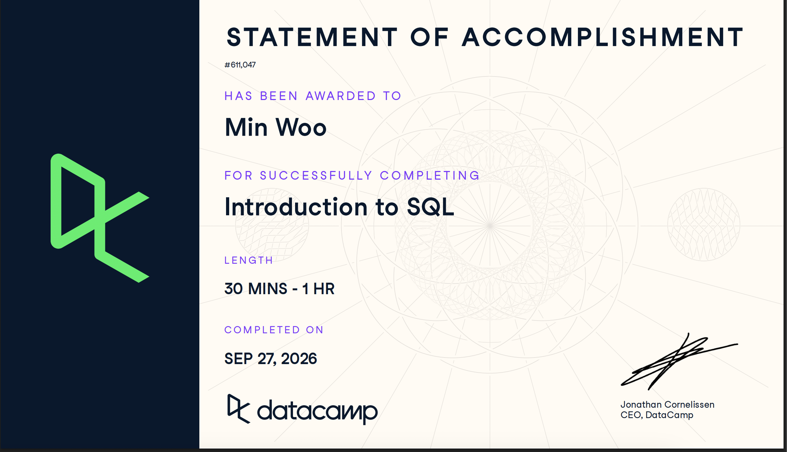

# Course-Completion Evidence

I completed the **Introduction to SQL** course through the IBM 6500 DataCamp classroom on September 27, 2026. The completion evidence below shows that I completed 100% of the assigned course.

{fig-alt="Screenshot showing Jungmin Woo's completion of the Introduction to SQL course" width="90%"}

# Learning Notes and Key Takeaways

## Meet Databases & SQL

### Main Ideas

A database is an organized collection of information that can be stored, searched, updated, and analyzed. In a relational database, information is organized into tables. Each **row** represents one observation or record, while each **column** represents an attribute of that record. For example, in a `leads` table, one row can represent one potential customer, while columns can store the lead's ID, name, email address, and country.

SQL, or Structured Query Language, allows users to communicate with relational databases. Instead of manually reviewing thousands of records, an analyst can write a query to retrieve only the information needed for a particular business question. Although systems such as PostgreSQL, MySQL, and BigQuery use different SQL flavors, their core syntax is generally similar.

The course also explained the relationship between a database server and a database client. The server stores the database and processes queries. The client connects to the server, sends SQL queries, and displays the returned results to the user.

### Important SQL Concepts

-   **Database:** An organized collection of stored information.
-   **Table:** A structure that organizes related data into rows and columns.
-   **Row:** One complete record, such as one lead or one campaign.
-   **Column:** One attribute, such as country, email, campaign name, or impressions.
-   **Database server:** Stores databases and processes client queries.
-   **Database client:** Sends queries to the server and displays the results.
-   **SQL flavor:** A version of SQL used by a particular database system.

### Example

``` sql
SELECT *
FROM leads;
```

### Explanation of the Example

This query retrieves every column and every available record from the `leads` table. The asterisk (`*`) is a shortcut meaning “all columns.” This type of query can be useful for initially inspecting a small table, although selecting only the necessary columns is usually clearer and more efficient when working with a large database.

### CEP Application

Understanding rows, columns, clients, and servers will help our CEP team interpret data exported from systems such as Clover. A Farm Store transaction table might contain one row per transaction and columns for the transaction date, product, category, quantity, price, and payment type. Recognizing this structure is the first step toward analyzing sales performance and inventory activity.

## Write Your First SQL

### Main Ideas

The second chapter introduced the basic structure of a SQL query. `SELECT` identifies the columns to return, and `FROM` identifies the table containing those columns. Although `SELECT *` returns all columns, naming individual columns makes the output easier to understand and ensures that the result contains only relevant information.

The chapter also introduced sorting and limiting query results. `ORDER BY` sorts records according to a selected column. `DESC` arranges values from highest to lowest, while `ASC` arranges values from lowest to highest. `LIMIT` restricts the number of rows returned. Together, these clauses can identify top- or bottom-performing records.

SQL keywords such as `SELECT`, `FROM`, `ORDER BY`, and `LIMIT` are commonly written in uppercase. Capitalization is not normally required for execution, but it distinguishes SQL keywords from table and column names and improves readability.

### Important SQL Syntax

| Syntax     | Purpose                               |
|------------|---------------------------------------|
| `SELECT`   | Specifies the columns to retrieve     |
| `FROM`     | Specifies the source table            |
| `*`        | Selects all columns                   |
| `ORDER BY` | Sorts the query results               |
| `ASC`      | Sorts from lowest to highest          |
| `DESC`     | Sorts from highest to lowest          |
| `LIMIT`    | Restricts the number of returned rows |

### Example 1: Selecting Relevant Columns

``` sql
SELECT campaign_id,
       campaign_name,
       impressions
FROM campaigns;
```

### Explanation of Example 1

This query selects three relevant columns from the `campaigns` table: the campaign identifier, campaign name, and number of impressions. It produces a more focused result than `SELECT *` because it excludes columns that are not needed for the analysis.

### Example 2: Finding the Highest-Impression Campaigns

``` sql
SELECT campaign_id,
       campaign_name,
       impressions
FROM campaigns
ORDER BY impressions DESC
LIMIT 10;
```

### Explanation of Example 2

This query retrieves the ten campaigns with the highest numbers of impressions. `ORDER BY impressions DESC` sorts the campaigns from the greatest number of impressions to the smallest, and `LIMIT 10` keeps only the first ten results. A marketer could use this output to identify campaigns that achieved the greatest audience exposure.

### Example 3: Finding the Lowest-Value Conversions

``` sql
SELECT conversion_id,
       conversion_value,
       status
FROM conversions
ORDER BY conversion_value ASC
LIMIT 5;
```

### Explanation of Example 3

This query returns the five lowest-value conversion records. It selects an identifier, the value being analyzed, and the conversion status. The results are sorted in ascending order so that the smallest conversion values appear first.

### CEP Application

These commands could help the Farm Store identify top-selling products, the categories generating the most revenue, or items with the lowest sales. For example, transaction records could be sorted by revenue in descending order and limited to the top ten products. The same approach could also identify slow-moving products that may require inventory adjustments or additional promotion.

## Complete Your SQL Foundation

### Main Ideas

The final chapter introduced `DISTINCT`, aliases, SQL flavors, and database architecture. `DISTINCT` removes duplicate values from a query result, which is useful when an analyst needs a list of unique categories, countries, or marketing channels. An alias created with `AS` gives a result column a clearer temporary name without changing the column name in the original database.

The chapter reinforced that different database systems share the same core SQL concepts but may differ in functions, supported features, and exact syntax. It also reviewed how the client-server architecture allows a user to submit a query through a client while the database server stores the data and performs the requested processing.

### Important SQL Syntax

| Syntax     | Purpose                                             |
|------------|-----------------------------------------------------|
| `DISTINCT` | Removes duplicate values from the result            |
| `AS`       | Assigns a temporary alias to a column or expression |

### Example 1: Finding Unique Lead Countries

``` sql
SELECT DISTINCT country
FROM leads;
```

### Explanation of Example 1

This query returns each country represented in the `leads` table only once. Even if multiple leads are located in the same country, `DISTINCT` removes repeated country values from the result.

### Example 2: Creating a Descriptive Alias

``` sql
SELECT DISTINCT channel AS unique_channels
FROM campaigns;
```

### Explanation of Example 2

This query retrieves the unique values in the `channel` column and labels the result column `unique_channels`. The alias makes the output easier for a reader to interpret, but it does not permanently rename the original `channel` column.

### CEP Application

`DISTINCT` could be used to identify all unique product categories, payment types, customer locations, or sales channels contained in the Farm Store data. Aliases could then give calculated or technical fields reader-friendly names for use in reports. These features would help the team organize raw Clover data and present understandable results to the client.

# Overall Reflection and Future Reference

The most useful skills I learned were selecting relevant columns, sorting records, limiting output, removing duplicate values, and creating descriptive aliases. These commands provide a foundation for answering practical marketing and business questions with data. I found it especially useful to see how `ORDER BY` and `LIMIT` work together to identify high- or low-performing records.

The distinction between a database server and a database client was initially less familiar than the query syntax. I also expect that remembering differences among SQL flavors will become more challenging as queries become more advanced. However, understanding that the main SQL structure remains similar across database systems makes the learning process more manageable.

SQL could support digital marketing analytics by retrieving campaign impressions, leads, conversion values, statuses, and marketing channels. It could also support customer insights by identifying geographic markets and organizing customer or survey records. For the CEP, SQL could help our team filter and summarize Farm Store transaction data, identify popular and low-performing products, and prepare organized datasets for further analysis and visualization.

In the future, I expect to review query order, sorting directions, aliases, and the syntax differences between SQL platforms. I will also return to these notes when learning filtering, aggregation, grouping, joins, and other intermediate SQL techniques.

# Appendix: Publication Links

-   [GitHub Repository](https://github.com/Min-woo0210/ibm-6500-sql-learning)
-   [Published Introduction to SQL Report](https://min-woo0210.github.io/ibm-6500-sql-learning/introduction-to-sql.html)